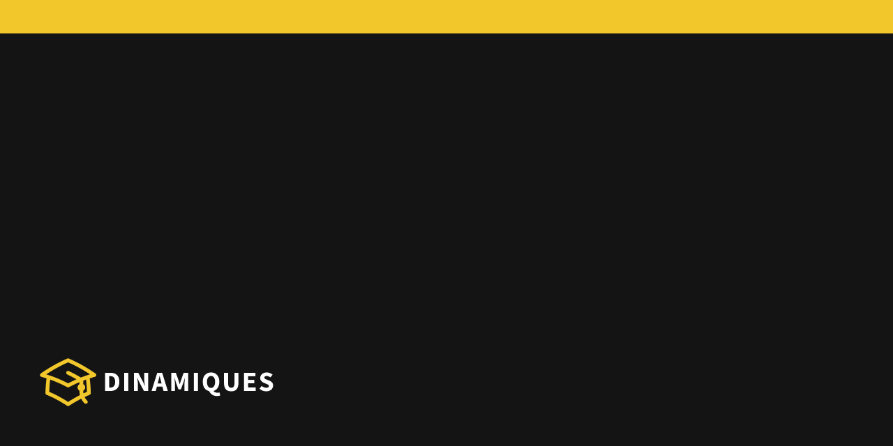
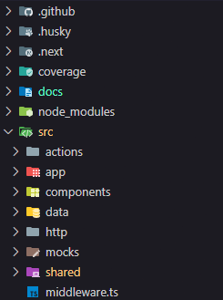

<p align="center">
  
  <hr>
  <h1 align="center">Dinamiques: conhecimento ao alcance de todos</h1>
</p>

<p align="center">
  
  <a aria-label="Last Commit" href="https://github.com/felipe-dr/dinamiques-web-next/commits/main">
    
  </a>
  <!--  -->
  
</p>

<br>

<p align="center">
  <a target="_blank" href="https://www.docker.com/">
    
  </a>
  <a target="_blank" href="https://docs.github.com/pt/actions">
    
  </a>
  <a target="_blank" href="https://commitlint.js.org/">
    
  </a>
  <a target="_blank" href="https://github.com/lint-staged/lint-staged">
    
  </a>
  <a target="_blank" href="https://typicode.github.io/husky/">
    
  </a>
</p>
<p align="center">
  <a target="_blank" href="https://nextjs.org/">
    
  </a>
  <a target="_blank" href="https://react.dev/">
    
  </a>
  <a target="_blank" href="https://www.typescriptlang.org/">
    
  </a>
  <a target="_blank" href="https://react-hook-form.com/">
    
  </a>
  <a target="_blank" href="https://github.com/remarkjs/react-markdown">
    
  </a>
  <a target="_blank" href="https://omgovich.github.io/react-colorful/">
    
  </a>
  <a target="_blank" href="https://cva.style/docs">
    
  </a>
  <a target="_blank" href="https://uiwjs.github.io/npm-unpkg/#/pkg/@uiw/react-md-editor/file/README.md">
    
  </a>
  <a target="_blank" href="https://tailwindcss.com/">
    
  </a>
  <a target="_blank" href="https://www.npmjs.com/package/clsx">
    
  </a>
  <a target="_blank" href="https://www.radix-ui.com/">
    
  </a>
  <a target="_blank" href="https://tanstack.com/">
    
  </a>
  <a target="_blank" href="https://date-fns.org/">
    
  </a>
  <a target="_blank" href="https://zod.dev/">
    
  </a>
  <a target="_blank" href="https://heroicons.com/">
    
  </a>
  <a target="_blank" href="https://jwt.io">
    
  </a>
  <a target="_blank" href="https://eslint.org/">
    
  </a>
  <a target="_blank" href="https://prettier.io/">
    
  </a>
  <a target="_blank" href="https://vitest.dev/">
    
  </a>
  <a target="_blank" href="https://testing-library.com/">
    
  </a>
  <a target="_blank" href="https://github.com/jsdom/jsdom">
    
  </a>
  <a target="_blank" href="https://postcss.org/">
    
  </a>
  <a target="_blank" href="https://chromewebstore.google.com/detail/lighthouse/blipmdconlkpinefehnmjammfjpmpbjk?hl=pt-br">
    
  </a>
  <a target="_blank" href="https://search.google.com/test/rich-results?hl=pt-BR">
    
  </a>
</p>

## Índice

<ol>
  <li><a href="#sobre">Sobre</a></li>
  <li><a href="#funcionalidades">Funcionalidades</a></li>
  <li><a href="#arquitetura">Arquitetura</a></li>
  <li><a href="#cicd">CI/CD</a></li>
  <li><a href="#como-executar">Como executar</a></li>
  <li><a href="#tecnologias">Tecnologias</a></li>
  <li><a href="#autor">Autor</a></li>
</ol>

## Sobre

Blog desenvolvido em NextJS que disponibiliza o acesso e leitura de artigos acadêmicos.

## Funcionalidades

> **IMPORTANTE !**
>
> - Nessa primeira versão não foi implementado o conceito de _roles_ para restringir acessos e definir permissões, porém posteriormente será implementado.
> - Os itens abaixo sem a marcação de checado são recursos que estão mapeados para serem implementados posteriormente.

- [x] **Usuário poderá se autenticar quando estiver com o status ativo**

- [ ] **Usuário autenticado como administrador poderá gerenciar:**

  > Todas as funcionalidades abaixo estão implementadas na API e serão integradas futuramente na interface.

  - **Usuários**
    - [ ] Criar
      - [ ] Com restrição de `email` e `username` únicos
    - [ ] Consultar todos
      - [ ] Com paginação e limite de itens
      - [ ] Ordenar por padrão em ordem decrescente de criação
      - [ ] Adicionar filtro para ordenação
    - [ ] Consultar por id
    - [ ] Consultar por email
    - [ ] Editar
      - [ ] Com restrição de `email` e `username` únicos
    - [ ] Deletar
      - [ ] Do tipo `soft delete` para se manter histórico
      - [ ] Não é possível deletar ( desativar ) um usuário já desativado
  - **Docentes**
    - [ ] Criar
      - [ ] Com restrição de `nome` único
    - [ ] Consultar todos
      - [ ] Com paginação e limite de itens
      - [ ] Ordenar por padrão em ordem decrescente de criação
      - [ ] Adicionar filtro para ordenação
    - [ ] Consultar por id
    - [ ] Consultar por nome
    - [ ] Editar
      - [ ] Com restrição de `nome` único
    - [ ] Deletar
      - [ ] É feita automaticamente a desativação do seu usuário correspondente

- [x] **Usuário autenticado como docente poderá gerenciar:**

  - **Categorias**
    - [x] Criar
      - [x] Com restrição de `nome` único
    - [x] Consultar todas
      - [x] Com paginação e limite de itens
      - [x] Ordenar por padrão em ordem decrescente de criação
      - [x] Ordenar por nome, ativo e criado em
    - [x] Visualizar detalhes
    - [x] Filtrar por nome
    - [x] Adicionar ou remover a exibição de colunas da tabela
    - [x] Editar
      - [x] Com restrição de `nome` único
    - [x] Deletar
      - [x] Com restrição de somente se não estiver associada em artigo(s)
  - **Artigos**
    - [x] Criar
      - [x] Com restrição de `título` e `slug` únicos
    - [x] Consultar todos
      - [x] Com paginação e limite de itens
      - [x] Ordenar por padrão em ordem decrescente de data da última publicação
      - [x] Ordernar por categoria, docente, título, data da última publicação, publicado e criado em
    - [x] Visualizar detalhes do artigo concatenando com dados do docente e categoria
    - [x] Filtrar por título
    - [x] Adicionar ou remover a exibição de colunas da tabela
    - [x] Editar
      - [x] Com restrição de `título` e `slug` únicos
    - [x] Deletar

- [x] **Usuário visitante não estritamente autenticado poderá acessar:**

  - **Página inicial**
    - [x] Consultar artigos
      - [ ] Com paginação e limite de itens
    - [x] Filtrar artigos por categoria ativa
    - [x] Filtrar artigos por título ou conteúdo na barra de pesquisa
  - **Página de detalhes do artigo**
    - [x] Visualizar detalhes do artigo
    - [x] Visualizar e acessar artigos ativos recomendados de mesma categoria
    - [ ] Compartilhar artigo nas principais redes sociais
    - [ ] Publicar um comentário no artigo
  - [ ] Favoritar artigo para leitura quando houver sido implementado o conceito de _roles_ e autenticação de visitante
  - [ ] Alternar entre tema claro e escuro
  - [ ] Alterar idioma
  - [ ] Alterar tamanho da fonte

## Arquitetura

O projeto foi desenvolvido seguindo diversas boas práticas e princípios arquiteturais para que se mantenha robusto e escalável para novas implementações. Futuramente poderá ser ainda mais aprimorado e aplicado DDD como foi feito na API.

- Clean code
- DRY ( Dont Repeat Yourself )

A estrutura de pastas é semântica e os arquivos estão devidamente categorizados de acordo com suas finalidades.



## CI/CD

Embora esteja sendo utilizado o `husky` com o `lintstaged` para já validar o arquivo tanto em sua estrutura de código, quanto na validação dos testes após cada `push`. Há ainda um `workflow` configurado com o `github actions` responsável por efetuar os fluxos abaixo, assim como executar os devidos `scripts` definidos em `package.json` com o sufixo `ci`.

- **Integração contínua**
  - Validação de testes **unitários** a cada `push` e em qualquer `branch`
  - Validação de testes de **integração** e de **e2e** em cada `pull request` **( Em breve )**
- **Entrega contínua ( Em breve )**
  - Após ser efetuado um `push` na `branch main` e já ter sido executado todo o fluxo de integração contínua, será feito o `build` prévio da aplicação e disponibilizada a imagem no `dockerhub`.

> **DICA !**
>
> Para mais detalhes das configurações feitas, pode-se acessar os arquivos na pasta [workflows](./.github/workflows/).

## Como executar

### Testes

#### Pré-requisitos

Instalar as dependências do projeto.

```bash
pnpm install
```

#### Unitários

```bash
pnpm run test
```

#### Cobertura

Será gerado um relatório no terminal, assim como um arquivo `index.html` dentro da pasta `./coverage/index.html` que poderá ser aberto para uma visão mais ampla.

```bash
pnpm run test:coverage
```

### Linters

A execução dos `linters` podem ser aplicados automaticamente dependendo da configuração do seu editor de código, ao salvar um arquivo, por exemplo, no `VSCODE`.
Mas se caso desejar executar via comando poderá executar os seguintes:

#### Eslint

```bash
pnpm run lint:fix
```

#### Prettier

```bash
pnpm run prettier:format
```

### Localmente

#### Pré-requisitos

- Instalar as dependências do projeto.
- A API e o banco de dados devem estar em execução.

```bash
pnpm install
```

Configure previamente as variáveis de ambiente criando um arquivo `.env` na raiz do projeto. É possível obter o nome das variáveis a serem definidas, no arquivo `.env.example` contida na pasta raiz do projeto.

```bash
# Futuramente quando o projeto estiver hospedado em uma plataforma, poderá ser informado o domínio abaixo
NEXT_PUBLIC_WEBSITE_URL=

# Atualmente no package.json está definido fixadamente a porta 4000 devido a incompatibilidades. Futuramente essa variável será utilizada
NEXT_PUBLIC_PORT=

# Informe um termo para o secret do token da API
NEXT_PUBLIC_JWT_SECRET=

# Informe a url da API
NEXT_PUBLIC_DINAMIQUES_API=http://localhost:3000/api/v1
```

A API e o banco de dados estando em execução, basta executar:

```bash
pnpm dev
```

#### Desenvolvimento com hot reload

Atualizar a variável de ambiente no arquivo `.env`.

```bash
NEXT_PUBLIC_DINAMIQUES_API=http://host.docker.internal:3000/api/v1
```

```bash
docker-compose up web-dev
```

#### Produção

Atualizar a variável de ambiente no arquivo `.env`.

```bash
NEXT_PUBLIC_DINAMIQUES_API=http://host.docker.internal:3000/api/v1
```

```bash
docker-compose up web-prod
```

Se houver algum problema com alguma criação anterior do container do docker, basta executar o comando abaixo, antes de executar o `docker-compose up web-prod --build` ou `docker-compose up web-dev --build`.

```bash
docker-compose down
```

#### Autenticação com usuário padrão

Como a rota de criação de usuário é protegida com autenticação, foi criado um usuário padrão para que seja possível se autenticar e acessar demais recursos. Segue abaixo os dados do usuário para autenticação inicial.

```json
{
  "email": "leticia.pereira@dinamiques.com.br",
  "password": "admin"
}
```

## Tecnologias

- [Docker](https://www.docker.com/)
- [CI/CD: GitHubActions](https://docs.github.com/pt/actions)
- [Next.js](https://nextjs.org/)
- [React](https://react.dev/)
- [ReactHookForm](https://react-hook-form.com/)
- [ReactMarkdown](https://github.com/remarkjs/react-markdown)
- [ReactColorful](https://omgovich.github.io/react-colorful/)
- [Typescript](https://www.typescriptlang.org/)
- [JWT](https://jwt.io/)
- [ESLint](https://eslint.org/)
- [Prettier](https://prettier.io/)
- [CommitLint](https://commitlint.js.org/)
- [LintStaged](https://github.com/lint-staged/lint-staged)
- [Husky](https://typicode.github.io/husky/)
- [Vitest](https://vitest.dev/)
- [TestingLibrary](https://testing-library.com/)
- [Tailwind](https://tailwindcss.com/)
- [ClassVarianceAuthority](https://cva.style/docs)
- [CLSX](https://www.npmjs.com/package/clsx)
- [RadixUI](https://www.radix-ui.com/)
- [Tanstack](https://tanstack.com/)
- [UIWReactMdEditor](https://uiwjs.github.io/npm-unpkg/#/pkg/@uiw/react-md-editor/file/README.md)
- [DateFns](https://date-fns.org/)
- [Zod](https://zod.dev/)
- [Heroicons](https://heroicons.com/)
- [JSdom](https://github.com/jsdom/jsdom)
- [PostCSS](https://postcss.org/)
- [Google: Lighthouse](https://chromewebstore.google.com/detail/lighthouse/blipmdconlkpinefehnmjammfjpmpbjk?hl=pt-br)
- [Google: RichResultsTest](https://search.google.com/test/rich-results?hl=pt-BR)

> **DICA !**
>
> Todas as demais dependências utilizadas podem ser visualizados acessando o [package.json](./package.json).

## Autor

<table>
  <tr>
    <td align="center">
      <a href="https://github.com/felipe-dr">
        
        <br />
        <sub>
          <b>Felipe DR</b>
        </sub>
      </a>
      <br />
      <a href="mailto:felipe.corp7@gmail.com" title="E-mail">📩</a>
    </td>
  </tr>
</table>
